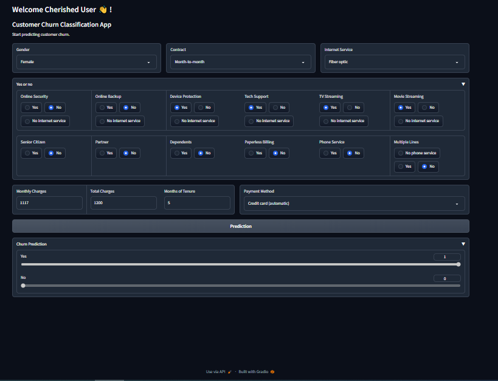

# Gradio-Classification-App

An application using Gradio for the Classifiaction Model Project (Customer Churn). We build the ML model into a web app to interact with it much easier, by inputing the required information, making predictions and showing the result.

## Summary
| Code      | Name        | Published Article |  Deployed App |
|-----------|-------------|:-------------:|------:|
| LP4 |Customer Churn Prediction Application with Gradio|  [Article](https://medium.com/@qacheampong/customer-churn-prediction-application-with-gradio-c2d444e6af0a/) | [Customer Churn Prediction App with Gradio](https://huggingface.co/spaces/Queensly/Customer_Churn_Prediction_GradioApp/)|

## Process Description
The process begins with exporting the necessary items from the notebook, building an interface that works correctly, importing the necessary items for modelling, and then writing the code to process inputs. The process can therefore be summarized as:

* Export machine learning items from notebook,
* Import the machine learning items into the app script,
* Build the interface,
* Write backend code to process inputs,
* Pass values through the interface,
* Recover these values in backend,
* Apply the necessary processing,
* Submit the processed values to the ML model to make the predictions,
* Process the predictions obtained and display them on the interface.

### Setup

You need [`Python3`](https://www.python.org/) on your system to setup this app.
Then you can clone this repo. At the repo's root, use the code from below which applies:

- Windows:
        
        python -m venv venv; venv\Scripts\activate; python -m pip install -q --upgrade pip; python -m pip install -qr requirements.txt  

 
## App Execution
Execute the app using: python app.py This will create a local URL which you will copy and paste in your browser. 

## App Interface Screenshot

## Author
Queensly K. Acheampongmaa

